This document has notes of bash commands used for solving tasks on overthewire.org game
====

## **BANDIT_0**

To establish an initial ssh remote session, in our terminal we have used the next bash comand  - `ssh bandit0@bandit.labs.overthewire.org -p 2220`, as instructed. The `ssh` part of the command is used to establish the remote ssh connection on the server located at `bandit.labs.overtherwire.org` and the connection is established on port number 2220 which we define using `-p` argument. After the conection has been established, on the password prompt, we have inserted the password `BANDIT0` as instructed. To solve this task we have used a basic shell comand `ls -la` to list the contents of the current directory (including hidden files). With the command `cat README.txt` we have printed the content of file "README.txt" in our terminal. The content was the password for the next task.
  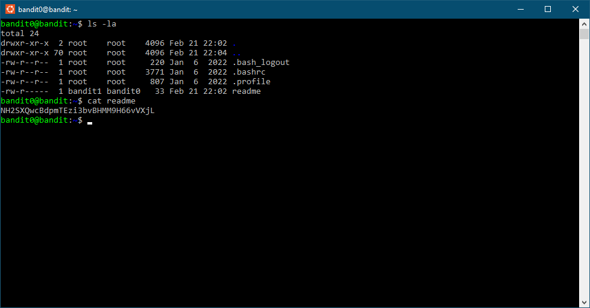

## **BANDIT1**

To establish an initial ssh remote session, in our terminal, after loging out from previous session using command `logout` we have used the next bash comand  - `ssh bandit1@bandit.labs.overthewire.org -p 2220`, as instructed. After the conection has been established, on the password prompt, we have inserted the password that we acquired from the previous task. To solve this task we have used a basic shell comand `ls -la` to list the contents of the current directory (including hidden files). Since the file which contains the password is named "-" we had to take another approach. With the command `cat ./-` we were able to print the content of this file in our terminal. The content was the password for the next task.
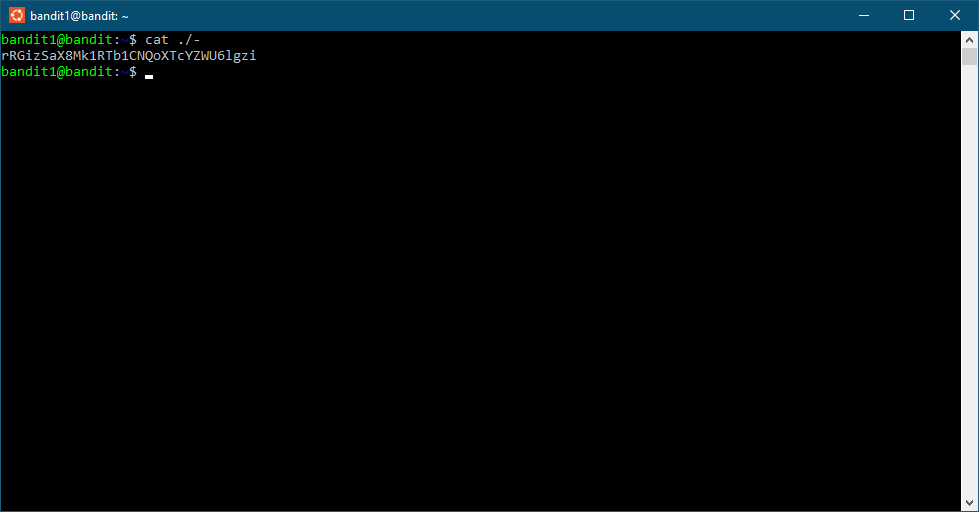

## **BANDIT2**

To establish an initial ssh remote session, in our terminal, after loging out from previous session using command `logout` we have used the next bash comand  - `ssh bandit2@bandit.labs.overthewire.org -p 2220`, as instructed. After the conection has been established, on the password prompt, we have inserted the password that we acquired from the previous task. To solve this task we have used a basic shell comand `ls -la` to list the contents of the current directory (including hidden files). Since the file which contains the password is named "*spaces in this filename*" we had to put the name of the file in quotation marks after the cat command. With the command `cat "spaces in this filename"` we were able to print the content of this file in our terminal. The content was the password for the next task.
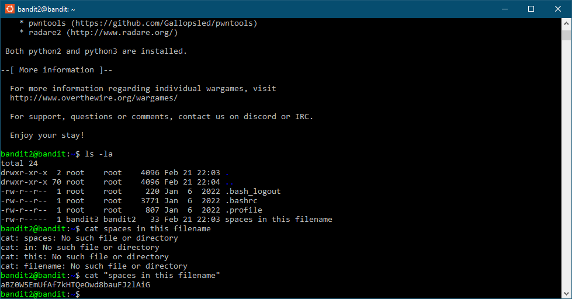

## **BANDIT3**

To establish an initial ssh remote session, in our terminal, after loging out from previous session using command `logout` we have used the next bash comand  - `ssh bandit3@bandit.labs.overthewire.org -p 2220`, as instructed. After the conection has been established, on the password prompt, we have inserted the password that we acquired from the previous task. To solve this task we have used a basic shell comand `ls -la` to list the contents of the current directory (including hidden files). The password for the next level is stored in a hidden file in the inhere directory. With the command `cd` we moved to the directory "*inhere*". We used the command `ls -la` again to list the content of the directory. After that we used command `cat` to display the content od the "*.hidden*" file. The content was the password for the next task.
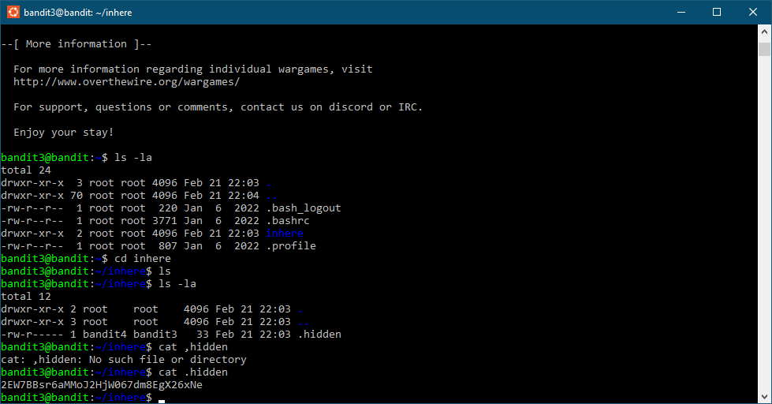

## **BANDIT4**

To establish an initial ssh remote session, in our terminal, after loging out from previous session using command `logout` we have used the next bash comand  - `ssh bandit4@bandit.labs.overthewire.org -p 2220`, as instructed. After the conection has been established, on the password prompt, we have inserted the password that we acquired from the previous task. To solve this task we have used a basic shell comand `ls -la` to list the contents of the current directory (including hidden files). The password for the next level is stored in the only human-readable file in the "*inhere*" directory. With the command `cd` we moved to the directory "*inhere*". We used the command `ls -la` again to list the content of the directory. After that we used command `find -type f | xargs file | grep text` to find the file in human-readable form which contains "*text*" in it's properties. Since the only file of that kind was file named *-file07* we used the `cat` command to print the contents of the mentioned file and acquire the password for the next task.
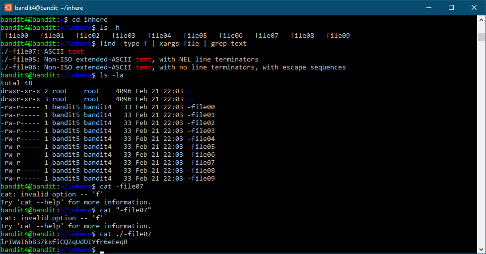

## **BANDIT5**

To establish an initial ssh remote session, in our terminal, after loging out from previous session using command `logout` we have used the next bash comand  - `ssh bandit5@bandit.labs.overthewire.org -p 2220`, as instructed. After the conection has been established, on the password prompt, we have inserted the password that we acquired from the previous task. To solve this task we have used a basic shell comand `ls -la` to list the contents of the current directory (including hidden files). The password for the next level is stored in a file somewhere under the "*inhere*" directory and has all of the following properties: *human-readable*, *1033 bytes in size* and
*not executable*. With the command `cd` we moved to the directory "*inhere*". We used the command `ls -la` again to list the content of the directory. After that we used command `find -type f -size 1033c` to find the file which is 1033 bytes in size. Since the only file of that kind was file named "*.file2*" we used the `cd` command to move to the desired directory and then `cat` command to print the contents of the mentioned file and acquire the password for the next task.
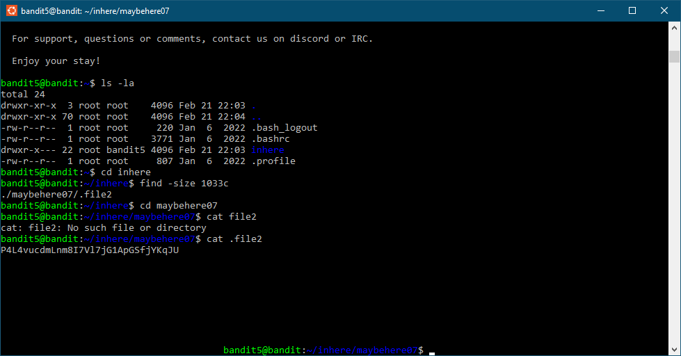

## **BANDIT6**

To establish an initial ssh remote session, in our terminal, after loging out from previous session using command `logout` we have used the next bash comand  - `ssh bandit6@bandit.labs.overthewire.org -p 2220`, as instructed. After the conection has been established, on the password prompt, we have inserted the password that we acquired from the previous task. To solve this task we have used a basic shell comand `ls -la` to list the contents of the current directory (including hidden files). The password for the next level is stored somewhere on the server and has all of the following properties: *owned by user bandit7*, *owned by group bandit6* and *33 bytes in size*. With the command `cd \` we moved to the root directory because we have to search the whole server. We used the command `find ./ -user bandit7 -group bandit6 -size 33c` to find everything in root which belongs to user *bandit7* and group *bandit6* and *is 33 bytes in size*. After the terminal listed all the items we visualy detected the file *bandit7.password* under directory *./var/lib/dpkg/info/* so we used the `cd` command to move to the desired directory and then `cat` command to print the contents of the mentioned file and acquire the password for the next task.
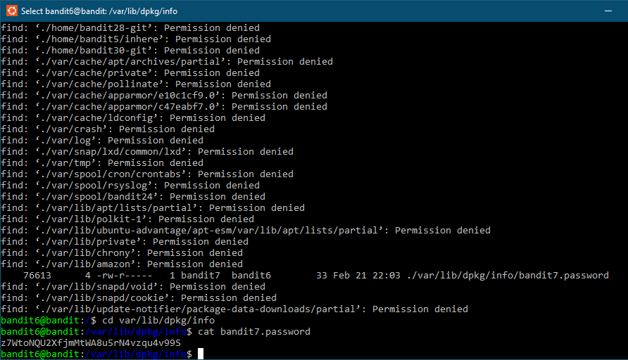

## **BANDIT7**

To establish an initial ssh remote session, in our terminal, after loging out from previous session using command `logout` we have used the next bash comand  - `ssh bandit7@bandit.labs.overthewire.org -p 2220`, as instructed. After the conection has been established, on the password prompt, we have inserted the password that we acquired from the previous task. To solve this task we have used a basic shell comand `ls -la` to list the contents of the current directory (including hidden files). The password for the next level is stored in the file "*data.txt*" next to the word "*millionth*". With the command `cat data.txt | grep millionth` in our terminal we printed out the line in the file which contains string "*millionth*" After the aformentioned string, the next block contained the password.
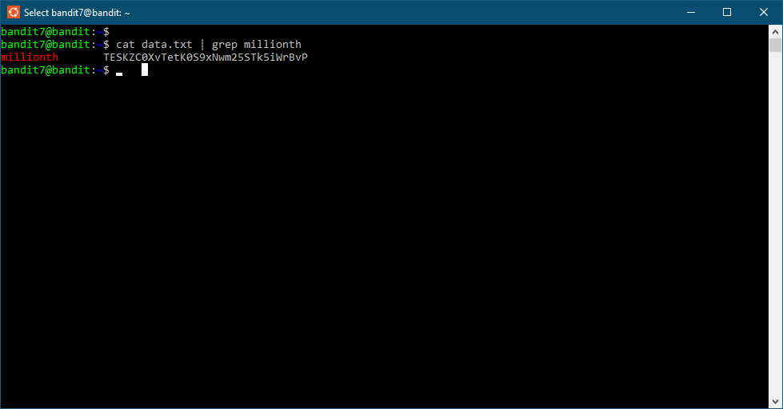

## **BANDIT8**

To establish an initial ssh remote session, in our terminal, after loging out from previous session using command `logout` we have used the next bash comand  - `ssh bandit8@bandit.labs.overthewire.org -p 2220`, as instructed. After the conection has been established, on the password prompt, we have inserted the password that we acquired from the previous task. To solve this task we have used a basic shell comand `ls -la` to list the contents of the current directory (including hidden files). The password for the next level is stored in the file "*data.txt*" and is the only line of text that occurs only once. With the command `cat data.txt` in our terminal we printed out the unsorted contents of the file. After that we used the command `sort data.txt | uniq -u` which sorted the lines of the file in alphabetical order so that the duplicated lines would be following one after another, while the *uniq* filter together with the *-u* argument prints out only the lines which are not followed by a duplicate (which are unique). The single printed-out line is the password for the next task.
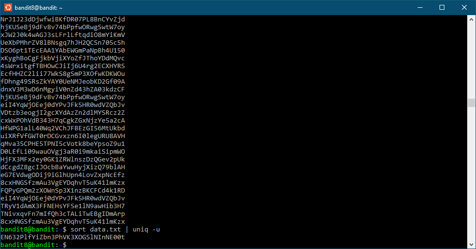

## **BANDIT9**

To establish an initial ssh remote session, in our terminal, after loging out from previous session using command `logout` we have used the next bash comand  - `ssh bandit9@bandit.labs.overthewire.org -p 2220`, as instructed. After the conection has been established, on the password prompt, we have inserted the password that we acquired from the previous task. To solve this task we have used a basic shell comand `ls -la` to list the contents of the current directory (including hidden files). The password for the next level is stored in the file "*data.txt*" in one of the few human-readable strings, preceded by several "=" characters. With the command `strings data.txt | grep ==` in our terminal we printed out the string (human-readable) contents of the file in the line which contains atleast two "=" signs. The printed-out lines contained the password for the next task.
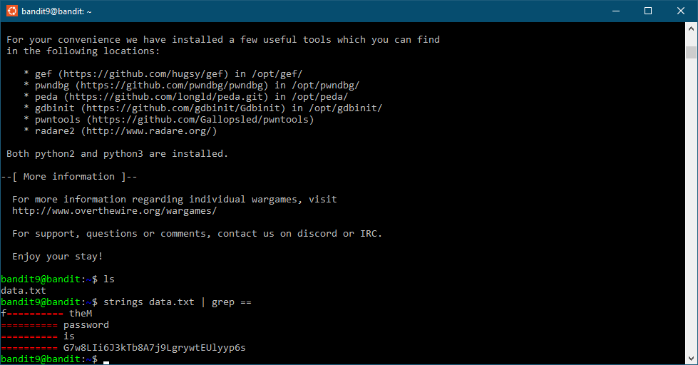

## **BANDIT10**

To establish an initial ssh remote session, in our terminal, after loging out from previous session using command `logout` we have used the next bash comand  - `ssh bandit10@bandit.labs.overthewire.org -p 2220`, as instructed. After the conection has been established, on the password prompt, we have inserted the password that we acquired from the previous task. To solve this task we have used a basic shell comand `ls` to list the contents of the current directory. The password for the next level is stored in the file "*data.txt*", which contains *base64* encoded data. With the command `cat data.txt` in our terminal we printed out the content of the file which is base64-encoded. Since it is encoded, we need to decode it, and we did it with `base64 data.txt -d` comand which decoded the "*data.txt*" file using the "*-d*" argument. The printed-out lines contained the password for the next task.
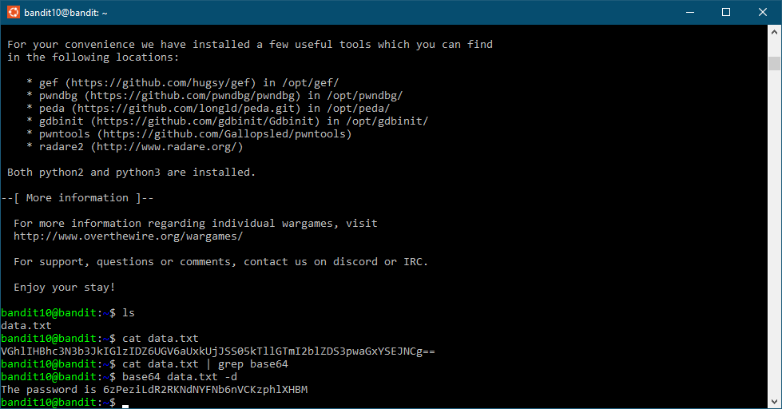